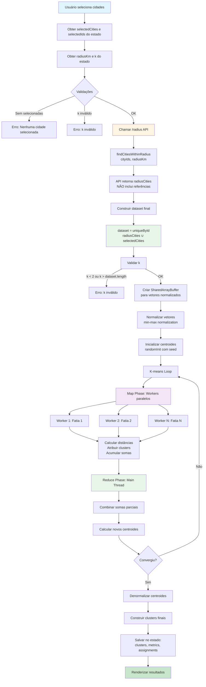
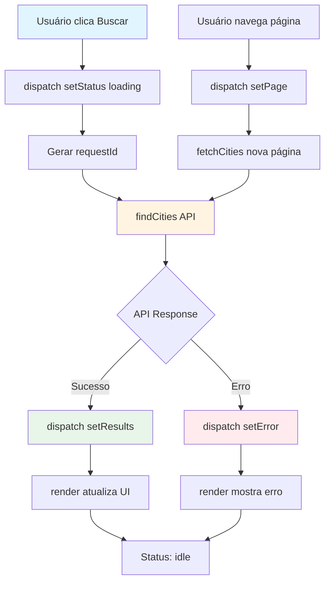
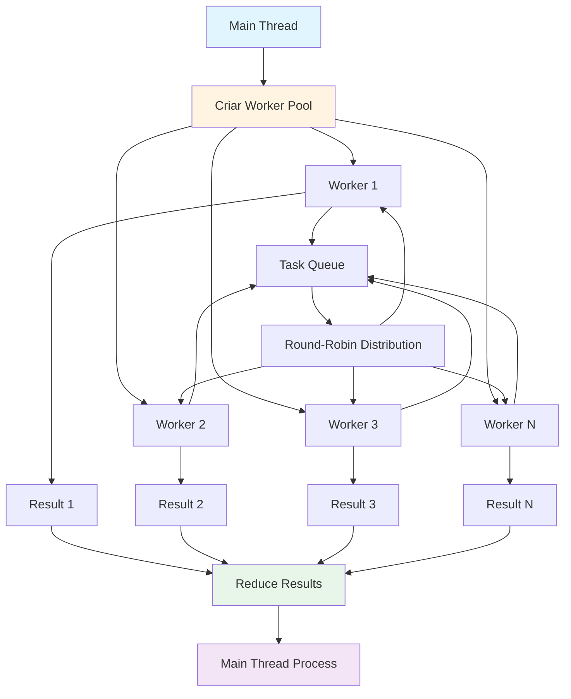
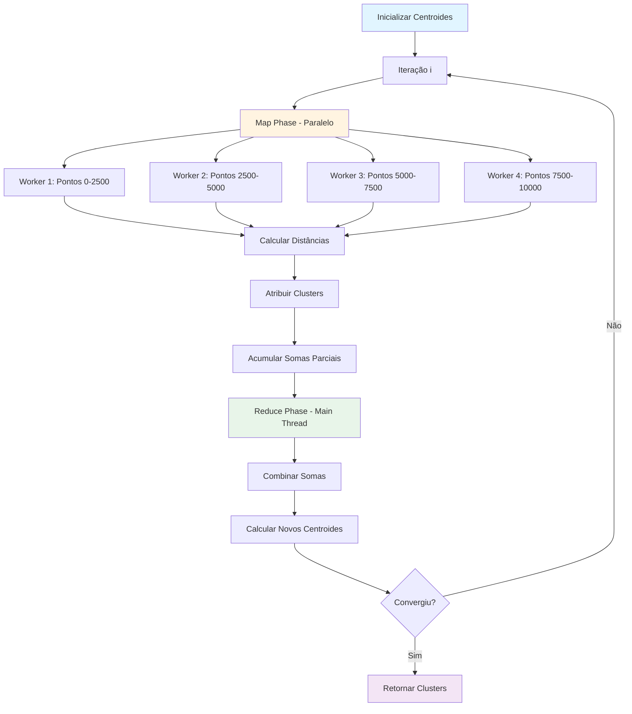
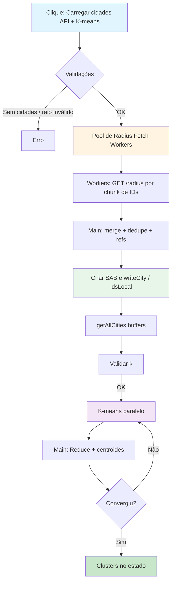
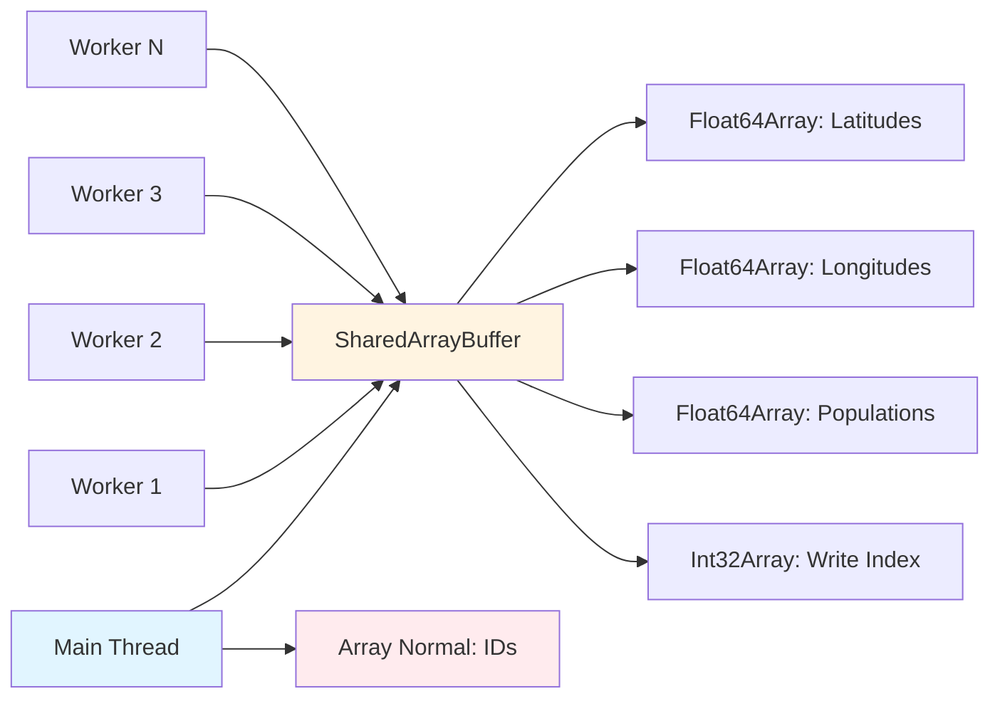

# GeoDB K-means Clustering - Trabalho de Paradigmas de Programação

## 📋 Objetivo do Trabalho

Este projeto implementa uma aplicação web completa para análise de dados geográficos utilizando múltiplos paradigmas de programação:

- **Programação Funcional**: Reducers puros, funções imutáveis, composição
- **Programação Assíncrona**: Promises, async/await, callbacks
- **Concorrência e Paralelismo**: Web Workers, SharedArrayBuffer, processamento paralelo
- **Arquitetura Declarativa**: Renderização baseada em estado, separação de responsabilidades

### Requisitos Atendidos

✅ **Consumo assíncrono de API** com tratamento de erros e rate limiting  
✅ **Paginação assíncrona** com prevenção de race conditions  
✅ **Carregamento massivo paralelo** (~10.000 registros) usando Web Workers  
✅ **Memória compartilhada** via SharedArrayBuffer para eficiência  
✅ **K-means paralelizado** com padrão Map/Reduce  
✅ **UI reativa** sem frameworks, renderização declarativa  
✅ **Store funcional** estilo Redux sem dependências externas  
✅ **Tratamento robusto de erros** mantendo UI funcional  
✅ **Cancelamento de operações** com cleanup adequado  

## 🚀 Como Rodar

### Pré-requisitos

- Node.js 20.19+ ou 22.12+
- npm ou yarn
- **Backend FastAPI** de cidades (este repositório pode ser usado junto ao `fastapi-app` do monorepo, ou outro backend que exponha `GET /api/v1/cities` e `GET /api/v1/cities/radius`)

### Instalação

1. Clone o repositório:
```bash
git clone <repository-url>
cd geodb-kmeans
```

2. Instale as dependências:
```bash
npm install
```

3. Configure as variáveis de ambiente:

Crie um arquivo `.env` na raiz do projeto (ou copie de `.envexample`):
```env
# URL do backend de cidades (FastAPI)
VITE_API_BASE_URL=http://localhost:8000
```

Se o backend estiver em outra URL, ajuste `VITE_API_BASE_URL` (ex.: `http://localhost:8000`). O frontend consome `GET /api/v1/cities` (paginação/busca) e `GET /api/v1/cities/radius` (cidades no raio para K-means).

4. Inicie o servidor de desenvolvimento:
```bash
npm run dev
```

5. Acesse `http://localhost:5173` no navegador

**⚠️ Importante**: Para usar SharedArrayBuffer, é necessário:
- Executar em HTTPS ou localhost (requisito de segurança do navegador)
- Headers Cross-Origin Isolation (COOP/COEP) configurados no servidor
- O arquivo `vite.config.js` já está configurado com esses headers automaticamente

### Configuração de SharedArrayBuffer (COOP/COEP)

O projeto usa **SharedArrayBuffer** para compartilhar dados entre Web Workers sem cópia, melhorando significativamente a performance do K-means paralelo.

**Requisitos**:
1. **HTTPS ou localhost**: SharedArrayBuffer só funciona em contextos seguros
2. **Headers COOP/COEP**: Configurados automaticamente no `vite.config.js`:
   ```javascript
   server: {
     headers: {
       'Cross-Origin-Opener-Policy': 'same-origin',
       'Cross-Origin-Embedder-Policy': 'require-corp'
     }
   }
   ```

**Como funciona**:
- O servidor de desenvolvimento (`npm run dev`) já inclui esses headers
- Em produção, você precisa configurar esses headers no servidor web (nginx, Apache, etc.)
- Sem esses headers, o código faz fallback automático para versão single-thread

**Verificação**:
- Abra o console do navegador
- Se SharedArrayBuffer estiver disponível, você verá logs de processamento paralelo
- Se não estiver, verá aviso e fallback para single-thread

## 📁 Onde Estão os Conceitos Implementados

### 1. Consumo Assíncrono

**Localização**: `src/api/geodbClient.js`, `src/app/events.js`

**Implementação**:
- Uso de `async/await` para operações assíncronas
- Promises para gerenciar fluxo assíncrono
- Callbacks de progresso para atualização em tempo real

**Exemplo**:
```javascript
// src/app/events.js - fetchCities()
async function fetchCities(store, page, query, sort) {
  store.dispatch(actions.setStatus('loading'));
  try {
    const result = await findCities({ namePrefix: query, sort, offset, limit });
    store.dispatch(actions.setResultsWithId(result.data, newRequestId));
  } catch (error) {
    store.dispatch(actions.setError(error.message));
  }
}
```

**Características**:
- Tratamento de erros com try/catch
- Race condition prevention via requestId
- Atualização de UI durante operações assíncronas

### 2. Concorrência vs Paralelismo

**Concorrência** (coordenada, single-threaded):
- **Localização**: `src/app/events.js` - paginação assíncrona
- Múltiplas requisições coordenadas no mesmo thread
- Gerenciamento via event loop e Promises
- Rate limiting para coordenar requisições

**Paralelismo** (verdadeiro, multi-threaded):
- **Localização**: `src/workers/` - Web Workers
- Múltiplos threads processando simultaneamente
- Workers independentes com SharedArrayBuffer
- Processamento verdadeiramente paralelo

**Comparação**:

| Aspecto | Concorrência | Paralelismo |
|---------|-------------|-------------|
| Threads | 1 (event loop) | Múltiplos (workers) |
| Execução | Alternada | Simultânea |
| Uso | Paginação, UI | Carregamento massivo, K-means |
| Memória | Compartilhada (normal) | Compartilhada (SAB) |

### 3. Web Workers

**Localização**: `src/workers/radiusFetchWorker.js`, `src/workers/kmeansWorker.js`, `src/workers/fetchWorker.js`

**Implementação**:

**Radius Fetch Worker** (`radiusFetchWorker.js`) — usado pelo botão "Carregar cidades (API) + Rodar K-means":
- Cada worker recebe um subconjunto de IDs de cidades de referência (selecionadas pelo usuário)
- Chama `GET /api/v1/cities/radius` para obter cidades dentro do raio (km) configurado
- Rate limiting: delay + jitter entre requisições
- Main thread faz merge, deduplicação, adiciona as cidades de referência e preenche SharedArrayBuffer; em seguida inicia K-means

**Fetch Worker** (`fetchWorker.js`) — carregamento por páginas (disponível no código):
- Busca páginas de `api/v1/cities` (limit/offset) em padrão strided por worker
- Estado da fila de requisições encapsulado em closure (`createRateLimitedFetcher()`), sem variáveis mutáveis em nível de módulo
- Escrita atômica em SharedArrayBuffer; IDs enviados ao main via mensagens `city-ids`

**K-means Worker** (`kmeansWorker.js`):
- **Implementação explícita** do K-means (sem biblioteca externa): distâncias e atualização de centroides no código
- Processa fatias de pontos a partir do SharedArrayBuffer; calcula distâncias (lat/long/pop) e atribui ao cluster mais próximo
- Retorna somas parciais (Map); o main faz Reduce (soma global, novo centroide) e controla convergência
- Não compartilha estado entre workers; escrita apenas no main

**Worker Pool** (`workerPool.js`):
- Gerencia pool de workers
- Distribuição round-robin de tarefas
- Callbacks de progresso
- Terminação e cleanup

**Exemplo de uso**:
```javascript
// src/app/events.js
const pool = createWorkerPool({ size: workerCount, workerUrl });
const promise = pool.runTask(payload, (progress) => {
  // Callback de progresso
});
```

### 4. Memória Compartilhada

**Localização**: `src/workers/sharedMemory.js`

**Implementação**:
- `SharedArrayBuffer` para arrays numéricos (lat, lon, pop)
- `Int32Array` para índice atômico (writeIndex)
- Operações atômicas via `Atomics.add()` para evitar race conditions
- Array normal (`idsLocal`) para strings (não compartilhável)

**Estrutura**:
```javascript
{
  indexBuffer: SharedArrayBuffer,      // Contador atômico
  latBuffer: SharedArrayBuffer,        // Float64Array
  lonBuffer: SharedArrayBuffer,        // Float64Array
  popBuffer: SharedArrayBuffer,        // Float64Array
  idxBuffer: SharedArrayBuffer,        // Int32Array (índices locais)
  idsLocal: Array                      // Strings (main thread only)
}
```

**Decisão de Design**:
- IDs da API são strings, mas SharedArrayBuffer requer tipos numéricos
- Solução: armazenar índice numérico no buffer, mapear IDs em array normal
- Permite escrita paralela eficiente mantendo referência a IDs originais

**Operações Atômicas**:
```javascript
// Alocação de slot atômica
function allocateSlot(writeIndex) {
  return Atomics.add(writeIndex, 0, 1); // Retorna valor anterior
}
```

### 5. Programação Funcional

**Localização**: `src/app/reducer.js`, `src/kmeans/`, `src/app/selectors.js`

#### Reducers Puros

**Exemplo**: `src/app/reducer.js`
```javascript
export function reducer(state = initialState, action) {
  switch (action.type) {
    case 'DATA/ADD_SELECTED': {
      const city = action.payload;
      // Não muta estado original
      return {
        ...state,
        selected: {
          ...state.selected,  // Spread operator
          [city.id]: city
        },
        selectedOrder: [...state.selectedOrder, city.id]  // Novo array
      };
    }
  }
}
```

**Características**:
- Sem efeitos colaterais
- Sem mutação (sempre retorna novo estado)
- Função pura (mesma entrada = mesma saída)
- Composable (pode combinar reducers)

#### Funções Puras

**Exemplo**: `src/kmeans/distance.js`
```javascript
export function euclideanDistance(point1, point2, normalization = null) {
  // Sem efeitos colaterais
  // Sem dependências externas
  // Determinística
  const dLat = point1.latitude - point2.latitude;
  const dLon = point1.longitude - point2.longitude;
  const dPop = point1.population - point2.population;
  return Math.sqrt(dLat * dLat + dLon * dLon + dPop * dPop);
}
```

**Outros exemplos**:
- `src/kmeans/math.js`: `mean()`, `variance()` - funções matemáticas puras
- `src/app/selectors.js`: Selectors derivam dados sem mutar estado
- `src/ui/templates.js`: Templates são funções puras que retornam HTML

#### Composição de Funções

**Exemplo**: `src/app/selectors.js`
```javascript
export function selectSelectedCities(state) {
  const selected = selectSelected(state);      // Composição
  const order = selectSelectedOrder(state);    // Composição
  return order.map(id => selected[id]).filter(Boolean);  // Pipeline funcional
}
```

#### Paradigma funcional: estado encapsulado em closures

O projeto evita estado global mutável em nível de módulo; o estado mutável necessário fica encapsulado em closures:

- **Store** (`src/app/state.js`): `createStore(reducer, initial)` mantém `currentState`, `isDispatching` e `listeners` **dentro da closure** do store retornado. Nenhuma variável mutável é exportada em nível de módulo.
- **Cliente API** (`src/api/geodbClient.js`): O cliente padrão é obtido via `getDefaultClient()`, implementado com uma IIFE que guarda `clientPromise` em closure. Ordenação de resultados feita de forma **imutável** (`[...normalized].sort(...)`).
- **Fetch Worker** (`src/workers/fetchWorker.js`): A fila de requisições e o contador de requisições ativas ficam dentro de `createRateLimitedFetcher()`; o módulo exporta apenas a função de fetch resultante.

Assim, o código segue o paradigma funcional: reducers e seletores permanecem puros; efeitos e estado mutável ficam contidos em poucos pontos e não vazam como globais.

### 6. Fluxo de Clustering com Endpoint /radius

**Localização**: `src/app/events.js`, `src/api/geodbClient.js`

#### Endpoint `/api/v1/cities/radius`

O endpoint `/radius` recebe uma lista de IDs de cidades de referência e um raio em quilômetros, retornando todas as cidades dentro do raio dessas referências.

**⚠️ Comportamento Importante**:
- O endpoint **NÃO retorna as cidades de referência** (as selecionadas pelo usuário)
- Apenas retorna cidades **dentro do raio**, excluindo as próprias referências
- Isso é um comportamento do endpoint da API FastAPI

#### Construção do Dataset Final

Como o endpoint não retorna as cidades de referência, o dataset final é construído através de uma união:

```javascript
dataset = uniqueById(radiusCities ∪ selectedCities)
```

Onde:
- `radiusCities`: Cidades retornadas pelo endpoint `/radius` (dentro do raio)
- `selectedCities`: Cidades selecionadas pelo usuário (referências)
- `uniqueById`: Remove duplicatas por ID (se uma cidade do raio já é uma referência, mantém a versão da referência)

**Por que isso é necessário para o K-means?**

1. **Preservar os "centros" escolhidos pelo usuário**: As cidades selecionadas representam pontos de interesse específicos que o usuário quer incluir no clustering. Sem incluí-las, perderíamos esses pontos de referência.

2. **Garantir representatividade**: As cidades de referência podem ser importantes para o contexto do clustering (ex: cidades principais de uma região). Excluí-las poderia resultar em clusters que não refletem a intenção do usuário.

3. **Completude do dataset**: O dataset final deve incluir tanto as cidades próximas (do raio) quanto as cidades de referência para um clustering completo e significativo.

**Exemplo**:
- Usuário seleciona: São Paulo (ID: 123), Rio de Janeiro (ID: 456)
- Chama `/radius` com raio 100km
- Retorna: 50 cidades dentro do raio (mas não inclui São Paulo nem Rio)
- Dataset final: 50 cidades do raio + 2 cidades selecionadas = 52 cidades (sem duplicatas)

#### Diagrama do Fluxo Completo



### 7. Implementação do K-means

O K-means é implementado **explicitamente** no código (sem biblioteca externa de clustering). As métricas de similaridade usadas são **latitude, longitude e população**; a distância é euclidiana sobre vetores normalizados (min-max). Workers calculam distâncias e somas parciais; o main thread faz Reduce (novos centroides) e verifica convergência.

**Localização**: `src/kmeans/kmeans.js`, `src/kmeans/kmeansParallel.js`, `src/workers/kmeansWorker.js`, `src/kmeans/distance.js`, `src/kmeans/init.js`, `src/kmeans/normalize.js`

#### Passo a Passo

**1. Inicialização** (`src/kmeans/init.js`):
```javascript
// Seleciona k pontos aleatórios como centroides iniciais
centroids = randomInit(data, k, seed);
```

**2. Loop Principal** (`src/kmeans/kmeans.js`):

**a) Map Phase (paralelo)**:
- Divide pontos entre workers
- Cada worker processa seu bloco
- Para cada ponto: encontra cluster mais próximo
- Acumula somas parciais: `sumLat[k]`, `sumLon[k]`, `sumPop[k]`, `count[k]`

**b) Reduce Phase (main thread)**:
- Combina somas parciais de todos os workers
- Calcula novos centroides: `centroid[k] = sum[k] / count[k]`
- Atualiza centroides

**c) Verificação de Convergência**:
- Calcula mudança total dos centroides
- Compara com threshold (epsilon)
- Verifica se assignments são estáveis

**3. Estrutura de Dados**:
```javascript
// Entrada (worker)
{
  centroids: [{lat, lon, pop}, ...],
  startIndex: 0,
  endIndex: 1000,
  sharedBuffers: {...}
}

// Saída (worker)
{
  sumLat: [0, 0, 0, ...],  // Somas por cluster
  sumLon: [0, 0, 0, ...],
  sumPop: [0, 0, 0, ...],
  counts: [0, 0, 0, ...]   // Contagens por cluster
}
```

**4. Algoritmo Completo**:
```
1. Inicializar centroides aleatoriamente
2. REPETIR até convergência:
   a) MAP (paralelo):
      - Worker i processa pontos [start_i, end_i]
      - Para cada ponto: encontrar cluster mais próximo
      - Acumular somas parciais
   b) REDUCE (main thread):
      - Combinar somas de todos os workers
      - Calcular novos centroides
   c) Verificar convergência
3. Retornar clusters finais
```

## 🔧 Limites e Decisões Técnicas

### Rate Limiting

**Estratégia**: Token Bucket por Worker

**Localização**: `src/api/rateLimit.js`, `src/workers/fetchWorker.js`

**Implementação**:
- Máximo 2 requisições simultâneas por worker
- Delay base de 500ms + jitter aleatório (0-200ms)
- Fila de requisições para evitar bloqueio

**Razão**:
- API tem limites de requisições por segundo
- Jitter evita "thundering herd" (todos workers requisitando ao mesmo tempo)
- Distribuição uniforme ao longo do tempo

**Configuração**:
```javascript
const MAX_CONCURRENT_REQUESTS = 2;
const REQUEST_DELAY_MS = 500;
const JITTER_MS = 200;
```

### Normalização de Features

**Localização**: `src/kmeans/distance.js`

**Problema**:
- Latitude: -90 a 90
- Longitude: -180 a 180
- População: 0 a milhões

**Solução**: Normalização Min-Max

```javascript
function normalize(value, min, max) {
  if (max === min) return 0.5;
  return (value - min) / (max - min);  // [0, 1]
}
```

**Aplicação**:
- Calcula min/max do dataset (amostra de 1000 pontos)
- Normaliza todas as features para [0, 1]
- Aplica na distância euclidiana

**Razão**:
- População domina distância sem normalização
- Normalização garante peso igual para todas as features
- Melhora qualidade dos clusters

### Critérios de Convergência

**Localização**: `src/kmeans/kmeans.js`

**Critérios** (OR lógico):

1. **Mudança Média < Epsilon**:
```javascript
const avgChange = totalChange / k;
converged = avgChange < epsilon;  // epsilon = 0.0001
```

2. **Assignments Estáveis**:
```javascript
const assignmentsStable = 
  previousAssignments && 
  allAssignments.every((a, i) => a === previousAssignments[i]);
```

**Parâmetros**:
- `maxIter = 100`: Limite máximo de iterações
- `epsilon = 0.0001`: Threshold de convergência

**Razão**:
- Dois critérios garantem convergência robusta
- Evita loops infinitos com maxIter
- Epsilon pequeno garante precisão

### Outras Decisões

**Capacidade de Buffer**: 10.000 cidades
- Balance entre memória e performance
- Suficiente para análise significativa

**Workers**: `hardwareConcurrency - 1`
- Deixa 1 core para UI/main thread
- Mínimo 2, máximo 8 workers

**Amostra de Cidades**: 30 por cluster
- Evita travar UI com muitos elementos
- Suficiente para visualização

## 📊 Diagramas

### Fluxo UI -> API



### Worker Pool



### K-means Paralelo (Map/Reduce)



### Fluxo Completo: Cidades selecionadas + raio → /radius → memória compartilhada → K-means

O botão "Carregar cidades (API) + Rodar K-means" exige **pelo menos uma cidade selecionada** e um **raio (km)**. O dataset é montado via endpoint `/api/v1/cities/radius` e depois processado por K-means.

1. **Validação**: Main verifica se há cidades selecionadas, raio > 0 e k ≥ 2.
2. **Bulk load**: Main cria um pool de **Radius Fetch Workers**. Cada worker recebe um subconjunto dos IDs das cidades de referência e chama `GET /api/v1/cities/radius` (city_ids, radius_km) em paralelo, com rate limiting (delay + jitter). Main coleta resultados parciais, faz merge e deduplicação, adiciona as cidades de referência ao dataset, cria SharedArrayBuffer e preenche com `writeCity` / `idsLocal`.
3. **Após o carregamento**: Main lê `getAllCities(buffers)`, valida k e inicia K-means no dataset em memória.
4. **K-means**: Implementação **explícita** em `kmeansParallel.js` e `kmeansWorker.js`: workers calculam distâncias (lat/long/pop) e somas parciais; main faz Reduce (novos centroides) e verifica convergência.



### Arquitetura de Memória Compartilhada



## 🧪 Teste Manual Guiado

### 1. Navegar Páginas

1. Digite "São" no campo de busca
2. Clique em "Buscar"
3. Verifique resultados na coluna esquerda
4. Clique em "Próxima página"
5. Verifique que novos resultados aparecem
6. Clique em "Página anterior"
7. Verifique que volta para página anterior

**Resultado esperado**: Paginação funciona corretamente, informações de página atualizadas.

### 2. Selecionar Cidades

1. Clique em "Adicionar" em algumas cidades
2. Verifique que aparecem na coluna "Cidades Selecionadas"
3. Verifique contador "Total" atualizado
4. Navegue para outra página e volte
5. Verifique que seleções permanecem
6. Clique em "Remover" em uma cidade
7. Clique em "Limpar selecionadas"

**Resultado esperado**: Seleção funciona, estado preservado entre páginas.

### 3. Rodar K-means (cidades no raio + clustering)

1. **Selecione ao menos uma cidade** nos resultados da API (botão "Adicionar") e defina o **Raio (km)** (ex.: 500).
2. Configure **k** (número de clusters), por exemplo 5 (mínimo: 2).
3. Clique em "Carregar cidades (API) + Rodar K-means"
4. Observe:
   - Status muda para "loading"
   - Logs mostram carregamento via workers chamando `/api/v1/cities/radius`
   - Progresso de cidades carregadas; main faz merge, dedupe e adiciona as referências
   - Status muda para "clustering"
   - Logs mostram iterações do K-means (mudança média por iteração)
   - Botão "Cancelar" aparece durante processamento
5. Aguarde convergência (~10-30 iterações)
6. Verifique mensagem de convergência

**Resultado esperado**:
- Dataset = cidades dentro do raio das selecionadas + cidades de referência; preenchido em SharedArrayBuffer
- K-means roda sobre esse dataset; clusters exibidos com centroides e amostra de cidades (lat/long/pop)

### 5. Verificar Clusters

1. Verifique seção "Clusters"
2. Cada cluster mostra:
   - Número e tamanho (n=...)
   - Coordenadas do centroide
   - Lista de cidades (amostra)
3. Use filtro "Filtrar por cluster"
4. Verifique painel "Métricas"
5. Clique em "Exportar JSON"

**Resultado esperado**: Clusters exibidos, filtro funciona, métricas corretas, exportação funciona.

### 6. Teste de Cancelamento

1. Inicie carregamento
2. Durante carregamento, clique "Cancelar"
3. Verifique: operação interrompida, status resetado
4. Repita durante K-means

**Resultado esperado**: Cancelamento funciona em ambos os estágios.

## 📚 Estrutura do Projeto

```
geodb-kmeans/
├── src/
│   ├── app/                  # Lógica da aplicação
│   │   ├── state.js          # Store funcional (estado em closure)
│   │   ├── reducer.js        # Reducers puros
│   │   ├── actions.js        # Action creators
│   │   ├── selectors.js      # Selectors funcionais
│   │   ├── render.js         # Renderização declarativa
│   │   ├── events.js         # Event handlers
│   │   ├── bootstrap.js      # Inicialização
│   │   └── initialState.js   # Estado inicial
│   ├── api/                  # Integração com API
│   │   ├── geodbClient.js    # Cliente FastAPI (getDefaultClient em closure)
│   │   ├── rateLimit.js      # Token bucket
│   │   └── paging.js         # Paginação
│   ├── workers/              # Web Workers
│   │   ├── fetchWorker.js    # Paginação strided (createRateLimitedFetcher)
│   │   ├── radiusFetchWorker.js  # /radius (usado pelo botão K-means)
│   │   ├── kmeansWorker.js   # Map phase do K-means
│   │   ├── workerPool.js     # Pool de workers
│   │   ├── sharedMemory.js   # SharedArrayBuffer / Atomics
│   │   └── sharedPoints.js   # Utilitários de pontos compartilhados
│   ├── kmeans/               # Algoritmo K-means
│   │   ├── distance.js       # Distância euclidiana (lat/lon/pop)
│   │   ├── init.js           # Inicialização de centroides
│   │   ├── kmeans.js         # K-means single-thread
│   │   ├── kmeansParallel.js # K-means com workers
│   │   ├── kmeansSingle.js   # Fallback single-thread
│   │   ├── math.js           # mean, variance, stdDev
│   │   ├── normalize.js      # Normalização min-max
│   │   └── schema.js         # Schemas de dados
│   └── ui/                   # Interface
│       ├── dom.js            # qs, on, setHTML
│       ├── templates.js      # Templates HTML
│       ├── clusterPlot.js     # Gráfico de clusters
│       └── styles.css        # Estilos
├── index.html
├── package.json
├── vite.config.js
├── .envexample               # Exemplo de .env (VITE_API_BASE_URL)
└── README.md
```

## 🔑 Conceitos Implementados

- ✅ **Store Funcional**: Mini-Redux sem dependências; estado em closure (sem variáveis globais mutáveis)
- ✅ **Paradigma Funcional**: Estado encapsulado em closures (store, cliente API, fetcher no worker); ordenação imutável
- ✅ **Web Workers**: Processamento paralelo (radius fetch, K-means)
- ✅ **SharedArrayBuffer**: Memória compartilhada com Atomics
- ✅ **Rate Limiting**: Controle de requisições (token bucket, fila por worker)
- ✅ **Race Condition Prevention**: Request IDs na paginação
- ✅ **Renderização Declarativa**: UI reativa a partir do estado
- ✅ **Programação Funcional**: Reducers e seletores puros; composição de funções
- ✅ **Map/Reduce**: K-means paralelizado em workers
- ✅ **Endpoint /radius**: Busca cidades por raio geográfico
- ✅ **Dataset Merge**: União de cidades do raio + referências selecionadas

## 📝 Scripts

- `npm run dev` - Servidor de desenvolvimento
- `npm run build` - Build para produção
- `npm run preview` - Preview do build

## ⚠️ Notas Importantes

1. **Backend**: O frontend espera um backend em `VITE_API_BASE_URL` (ex.: FastAPI com `GET /api/v1/cities` e `GET /api/v1/cities/radius`).
2. **SharedArrayBuffer**: Requer HTTPS ou localhost e headers COOP/COEP (já configurados no Vite para desenvolvimento).
3. **Rate Limits**: Rate limiting automático nos workers para não saturar a API.
4. **Workers**: Número de workers definido com base em `navigator.hardwareConcurrency` (mín. 2, máx. 8).

## 🐛 Troubleshooting

**SharedArrayBuffer não disponível**: Execute em HTTPS ou localhost e confira os headers COOP/COEP no servidor.

**Erro de API / rede**: Confirme que o backend está rodando e que `VITE_API_BASE_URL` no `.env` está correto (ex.: `http://localhost:8000`).

**Workers não funcionam**: Use navegador moderno (Chrome, Firefox, Edge) com suporte a Web Workers e SharedArrayBuffer.

## 📄 Licença

Trabalho acadêmico - Paradigmas de Programação
