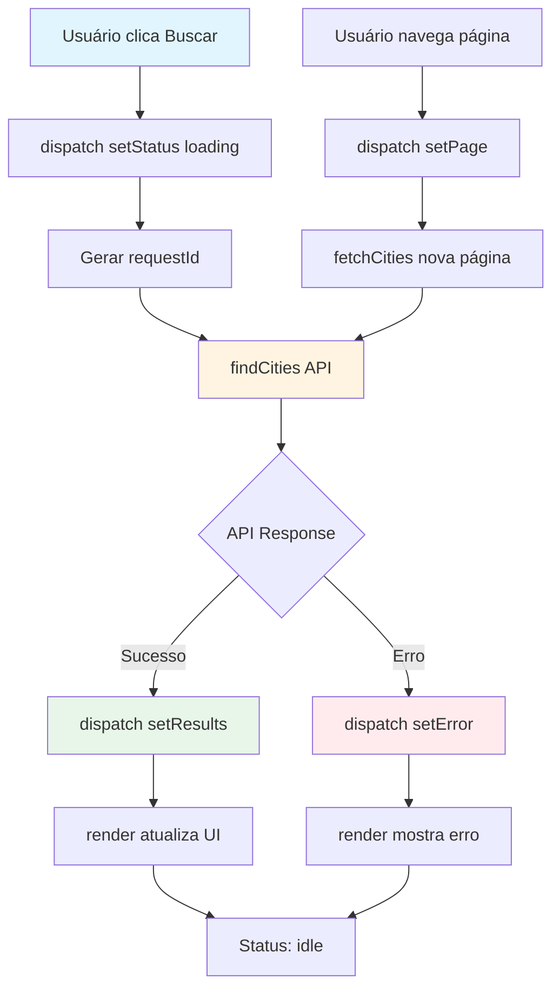
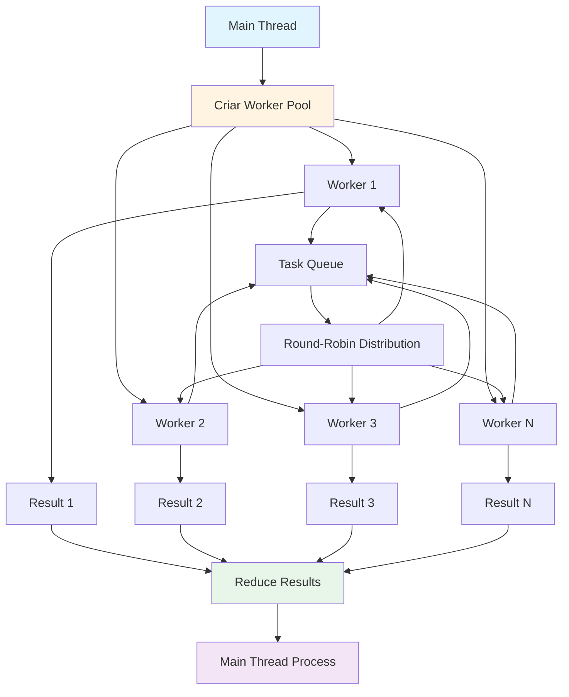
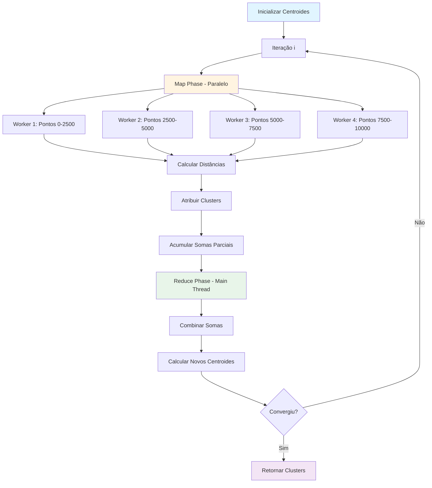
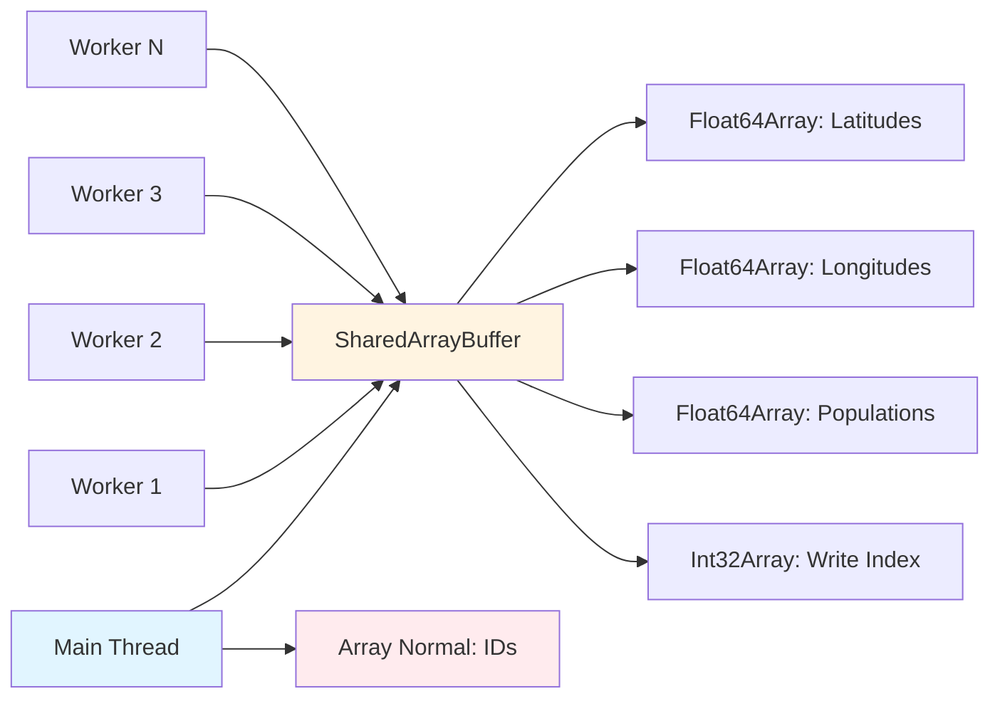

# GeoDB K-means Clustering - Trabalho de Paradigmas de Programação

## 📋 Objetivo do Trabalho

Este projeto implementa uma aplicação web completa para análise de dados geográficos utilizando múltiplos paradigmas de programação:

- **Programação Funcional**: Reducers puros, funções imutáveis, composição
- **Programação Assíncrona**: Promises, async/await, callbacks
- **Concorrência e Paralelismo**: Web Workers, SharedArrayBuffer, processamento paralelo
- **Arquitetura Declarativa**: Renderização baseada em estado, separação de responsabilidades

### Requisitos Atendidos

✅ **Consumo assíncrono de API** com tratamento de erros e rate limiting  
✅ **Paginação assíncrona** com prevenção de race conditions  
✅ **Carregamento massivo paralelo** (~10.000 registros) usando Web Workers  
✅ **Memória compartilhada** via SharedArrayBuffer para eficiência  
✅ **K-means paralelizado** com padrão Map/Reduce  
✅ **UI reativa** sem frameworks, renderização declarativa  
✅ **Store funcional** estilo Redux sem dependências externas  
✅ **Tratamento robusto de erros** mantendo UI funcional  
✅ **Cancelamento de operações** com cleanup adequado  

## 🚀 Como Rodar

### Pré-requisitos

- Node.js 20.19+ ou 22.12+
- npm ou yarn
- Chave da API RapidAPI (GeoDB Cities)

### Instalação

1. Clone o repositório:
```bash
git clone <repository-url>
cd geodb-kmeans
```

2. Instale as dependências:
```bash
npm install
```

3. Configure as variáveis de ambiente:

Crie um arquivo `.env` na raiz do projeto:
```env
VITE_RAPIDAPI_KEY=sua_chave_rapidapi_aqui
VITE_RAPIDAPI_HOST=wft-geo-db.p.rapidapi.com
```

**Como obter a chave da API:**
1. Acesse [RapidAPI GeoDB Cities](https://rapidapi.com/wirefreethought/api/geodb-cities)
2. Crie uma conta gratuita
3. Inscreva-se no plano básico (gratuito)
4. Copie sua chave da API
5. Cole no arquivo `.env`

4. Inicie o servidor de desenvolvimento:
```bash
npm run dev
```

5. Acesse `http://localhost:5173` no navegador

**⚠️ Importante**: Para usar SharedArrayBuffer, é necessário:
- Executar em HTTPS ou localhost (requisito de segurança do navegador)
- Headers Cross-Origin Isolation (COOP/COEP) configurados no servidor
- O arquivo `vite.config.js` já está configurado com esses headers automaticamente

## 📁 Onde Estão os Conceitos Implementados

### 1. Consumo Assíncrono

**Localização**: `src/api/geodbClient.js`, `src/app/events.js`

**Implementação**:
- Uso de `async/await` para operações assíncronas
- Promises para gerenciar fluxo assíncrono
- Callbacks de progresso para atualização em tempo real

**Exemplo**:
```javascript
// src/app/events.js - fetchCities()
async function fetchCities(store, page, query, sort) {
  store.dispatch(actions.setStatus('loading'));
  try {
    const result = await findCities({ namePrefix: query, sort, offset, limit });
    store.dispatch(actions.setResultsWithId(result.data, newRequestId));
  } catch (error) {
    store.dispatch(actions.setError(error.message));
  }
}
```

**Características**:
- Tratamento de erros com try/catch
- Race condition prevention via requestId
- Atualização de UI durante operações assíncronas

### 2. Concorrência vs Paralelismo

**Concorrência** (coordenada, single-threaded):
- **Localização**: `src/app/events.js` - paginação assíncrona
- Múltiplas requisições coordenadas no mesmo thread
- Gerenciamento via event loop e Promises
- Rate limiting para coordenar requisições

**Paralelismo** (verdadeiro, multi-threaded):
- **Localização**: `src/workers/` - Web Workers
- Múltiplos threads processando simultaneamente
- Workers independentes com SharedArrayBuffer
- Processamento verdadeiramente paralelo

**Comparação**:

| Aspecto | Concorrência | Paralelismo |
|---------|-------------|-------------|
| Threads | 1 (event loop) | Múltiplos (workers) |
| Execução | Alternada | Simultânea |
| Uso | Paginação, UI | Carregamento massivo, K-means |
| Memória | Compartilhada (normal) | Compartilhada (SAB) |

### 3. Web Workers

**Localização**: `src/workers/fetchWorker.js`, `src/workers/kmeansWorker.js`

**Implementação**:

**Fetch Worker** (`fetchWorker.js`):
- Busca páginas de cidades em paralelo
- Padrão strided (intercalado) para distribuição
- Rate limiting por worker
- Escrita atômica em SharedArrayBuffer

**K-means Worker** (`kmeansWorker.js`):
- Processa blocos de pontos
- Calcula distâncias e atribui clusters
- Retorna somas parciais (Map phase)
- Não compartilha estado entre workers

**Worker Pool** (`workerPool.js`):
- Gerencia pool de workers
- Distribuição round-robin de tarefas
- Callbacks de progresso
- Terminação e cleanup

**Exemplo de uso**:
```javascript
// src/app/events.js
const pool = createWorkerPool({ size: workerCount, workerUrl });
const promise = pool.runTask(payload, (progress) => {
  // Callback de progresso
});
```

### 4. Memória Compartilhada

**Localização**: `src/workers/sharedMemory.js`

**Implementação**:
- `SharedArrayBuffer` para arrays numéricos (lat, lon, pop)
- `Int32Array` para índice atômico (writeIndex)
- Operações atômicas via `Atomics.add()` para evitar race conditions
- Array normal (`idsLocal`) para strings (não compartilhável)

**Estrutura**:
```javascript
{
  indexBuffer: SharedArrayBuffer,      // Contador atômico
  latBuffer: SharedArrayBuffer,        // Float64Array
  lonBuffer: SharedArrayBuffer,        // Float64Array
  popBuffer: SharedArrayBuffer,        // Float64Array
  idxBuffer: SharedArrayBuffer,        // Int32Array (índices locais)
  idsLocal: Array                      // Strings (main thread only)
}
```

**Decisão de Design**:
- IDs da API são strings, mas SharedArrayBuffer requer tipos numéricos
- Solução: armazenar índice numérico no buffer, mapear IDs em array normal
- Permite escrita paralela eficiente mantendo referência a IDs originais

**Operações Atômicas**:
```javascript
// Alocação de slot atômica
function allocateSlot(writeIndex) {
  return Atomics.add(writeIndex, 0, 1); // Retorna valor anterior
}
```

### 5. Programação Funcional

**Localização**: `src/app/reducer.js`, `src/kmeans/`, `src/app/selectors.js`

#### Reducers Puros

**Exemplo**: `src/app/reducer.js`
```javascript
export function reducer(state = initialState, action) {
  switch (action.type) {
    case 'DATA/ADD_SELECTED': {
      const city = action.payload;
      // Não muta estado original
      return {
        ...state,
        selected: {
          ...state.selected,  // Spread operator
          [city.id]: city
        },
        selectedOrder: [...state.selectedOrder, city.id]  // Novo array
      };
    }
  }
}
```

**Características**:
- Sem efeitos colaterais
- Semmutação (sempre retorna novo estado)
- Função pura (mesma entrada = mesma saída)
- Composable (pode combinar reducers)

#### Funções Puras

**Exemplo**: `src/kmeans/distance.js`
```javascript
export function euclideanDistance(point1, point2, normalization = null) {
  // Sem efeitos colaterais
  // Sem dependências externas
  // Determinística
  const dLat = point1.latitude - point2.latitude;
  const dLon = point1.longitude - point2.longitude;
  const dPop = point1.population - point2.population;
  return Math.sqrt(dLat * dLat + dLon * dLon + dPop * dPop);
}
```

**Outros exemplos**:
- `src/kmeans/math.js`: `mean()`, `variance()` - funções matemáticas puras
- `src/app/selectors.js`: Selectors derivam dados sem mutar estado
- `src/ui/templates.js`: Templates são funções puras que retornam HTML

#### Composição de Funções

**Exemplo**: `src/app/selectors.js`
```javascript
export function selectSelectedCities(state) {
  const selected = selectSelected(state);      // Composição
  const order = selectSelectedOrder(state);    // Composição
  return order.map(id => selected[id]).filter(Boolean);  // Pipeline funcional
}
```

### 6. Implementação do K-means

**Localização**: `src/kmeans/kmeans.js`, `src/workers/kmeansWorker.js`

#### Passo a Passo

**1. Inicialização** (`src/kmeans/init.js`):
```javascript
// Seleciona k pontos aleatórios como centroides iniciais
centroids = randomInit(data, k, seed);
```

**2. Loop Principal** (`src/kmeans/kmeans.js`):

**a) Map Phase (paralelo)**:
- Divide pontos entre workers
- Cada worker processa seu bloco
- Para cada ponto: encontra cluster mais próximo
- Acumula somas parciais: `sumLat[k]`, `sumLon[k]`, `sumPop[k]`, `count[k]`

**b) Reduce Phase (main thread)**:
- Combina somas parciais de todos os workers
- Calcula novos centroides: `centroid[k] = sum[k] / count[k]`
- Atualiza centroides

**c) Verificação de Convergência**:
- Calcula mudança total dos centroides
- Compara com threshold (epsilon)
- Verifica se assignments são estáveis

**3. Estrutura de Dados**:
```javascript
// Entrada (worker)
{
  centroids: [{lat, lon, pop}, ...],
  startIndex: 0,
  endIndex: 1000,
  sharedBuffers: {...}
}

// Saída (worker)
{
  sumLat: [0, 0, 0, ...],  // Somas por cluster
  sumLon: [0, 0, 0, ...],
  sumPop: [0, 0, 0, ...],
  counts: [0, 0, 0, ...]   // Contagens por cluster
}
```

**4. Algoritmo Completo**:
```
1. Inicializar centroides aleatoriamente
2. REPETIR até convergência:
   a) MAP (paralelo):
      - Worker i processa pontos [start_i, end_i]
      - Para cada ponto: encontrar cluster mais próximo
      - Acumular somas parciais
   b) REDUCE (main thread):
      - Combinar somas de todos os workers
      - Calcular novos centroides
   c) Verificar convergência
3. Retornar clusters finais
```

## 🔧 Limites e Decisões Técnicas

### Rate Limiting

**Estratégia**: Token Bucket por Worker

**Localização**: `src/api/rateLimit.js`, `src/workers/fetchWorker.js`

**Implementação**:
- Máximo 2 requisições simultâneas por worker
- Delay base de 500ms + jitter aleatório (0-200ms)
- Fila de requisições para evitar bloqueio

**Razão**:
- API tem limites de requisições por segundo
- Jitter evita "thundering herd" (todos workers requisitando ao mesmo tempo)
- Distribuição uniforme ao longo do tempo

**Configuração**:
```javascript
const MAX_CONCURRENT_REQUESTS = 2;
const REQUEST_DELAY_MS = 500;
const JITTER_MS = 200;
```

### Normalização de Features

**Localização**: `src/kmeans/distance.js`

**Problema**:
- Latitude: -90 a 90
- Longitude: -180 a 180
- População: 0 a milhões

**Solução**: Normalização Min-Max

```javascript
function normalize(value, min, max) {
  if (max === min) return 0.5;
  return (value - min) / (max - min);  // [0, 1]
}
```

**Aplicação**:
- Calcula min/max do dataset (amostra de 1000 pontos)
- Normaliza todas as features para [0, 1]
- Aplica na distância euclidiana

**Razão**:
- População domina distância sem normalização
- Normalização garante peso igual para todas as features
- Melhora qualidade dos clusters

### Critérios de Convergência

**Localização**: `src/kmeans/kmeans.js`

**Critérios** (OR lógico):

1. **Mudança Média < Epsilon**:
```javascript
const avgChange = totalChange / k;
converged = avgChange < epsilon;  // epsilon = 0.0001
```

2. **Assignments Estáveis**:
```javascript
const assignmentsStable = 
  previousAssignments && 
  allAssignments.every((a, i) => a === previousAssignments[i]);
```

**Parâmetros**:
- `maxIter = 100`: Limite máximo de iterações
- `epsilon = 0.0001`: Threshold de convergência

**Razão**:
- Dois critérios garantem convergência robusta
- Evita loops infinitos com maxIter
- Epsilon pequeno garante precisão

### Outras Decisões

**Capacidade de Buffer**: 10.000 cidades
- Balance entre memória e performance
- Suficiente para análise significativa

**Workers**: `hardwareConcurrency - 1`
- Deixa 1 core para UI/main thread
- Mínimo 2, máximo 8 workers

**Amostra de Cidades**: 30 por cluster
- Evita travar UI com muitos elementos
- Suficiente para visualização

## 📊 Diagramas

### Fluxo UI -> API



### Worker Pool



### K-means Paralelo (Map/Reduce)



### Arquitetura de Memória Compartilhada



## 🧪 Teste Manual Guiado

### 1. Navegar Páginas

1. Digite "São" no campo de busca
2. Clique em "Buscar"
3. Verifique resultados na coluna esquerda
4. Clique em "Próxima página"
5. Verifique que novos resultados aparecem
6. Clique em "Página anterior"
7. Verifique que volta para página anterior

**Resultado esperado**: Paginação funciona corretamente, informações de página atualizadas.

### 2. Selecionar Cidades

1. Clique em "Adicionar" em algumas cidades
2. Verifique que aparecem na coluna "Cidades Selecionadas"
3. Verifique contador "Total" atualizado
4. Navegue para outra página e volte
5. Verifique que seleções permanecem
6. Clique em "Remover" em uma cidade
7. Clique em "Limpar selecionadas"

**Resultado esperado**: Seleção funciona, estado preservado entre páginas.

### 3. Carregar 10k Cidades

1. Configure k=5 no campo numérico
2. Clique em "Carregar ~10k cidades..."
3. Observe:
   - Status muda para "loading"
   - Barra de progresso atualiza
   - Logs mostram progresso
   - Botão "Cancelar" aparece
4. Aguarde conclusão (~2-5 minutos)
5. Verifique logs: workers usados, cidades carregadas, tempo

**Resultado esperado**: ~10.000 cidades carregadas em paralelo.

### 4. Rodar K-means

1. Após carregamento, K-means inicia automaticamente
2. Observe:
   - Status muda para "clustering"
   - Logs mostram iterações
   - Mudança média por iteração diminui
3. Aguarde convergência (~10-30 iterações)
4. Verifique mensagem de convergência

**Resultado esperado**: K-means converge, clusters criados.

### 5. Verificar Clusters

1. Verifique seção "Clusters"
2. Cada cluster mostra:
   - Número e tamanho (n=...)
   - Coordenadas do centroide
   - Lista de cidades (amostra)
3. Use filtro "Filtrar por cluster"
4. Verifique painel "Métricas"
5. Clique em "Exportar JSON"

**Resultado esperado**: Clusters exibidos, filtro funciona, métricas corretas, exportação funciona.

### 6. Teste de Cancelamento

1. Inicie carregamento
2. Durante carregamento, clique "Cancelar"
3. Verifique: operação interrompida, status resetado
4. Repita durante K-means

**Resultado esperado**: Cancelamento funciona em ambos os estágios.

## 📚 Estrutura do Projeto

```
geodb-kmeans/
├── src/
│   ├── app/              # Lógica da aplicação
│   │   ├── state.js      # Store funcional
│   │   ├── reducer.js    # Reducers puros
│   │   ├── actions.js    # Action creators
│   │   ├── selectors.js  # Selectors funcionais
│   │   ├── render.js     # Renderização declarativa
│   │   ├── events.js      # Event handlers
│   │   └── bootstrap.js  # Inicialização
│   ├── api/              # Integração com API
│   │   ├── geodbClient.js
│   │   ├── rateLimit.js
│   │   └── paging.js
│   ├── workers/          # Web Workers
│   │   ├── fetchWorker.js
│   │   ├── kmeansWorker.js
│   │   ├── workerPool.js
│   │   └── sharedMemory.js
│   ├── kmeans/           # Algoritmo K-means
│   │   ├── distance.js
│   │   ├── init.js
│   │   ├── kmeans.js
│   │   └── math.js
│   └── ui/               # Interface
│       ├── dom.js
│       ├── templates.js
│       └── styles.css
├── index.html
├── package.json
└── README.md
```

## 🔑 Conceitos Implementados

- ✅ **Store Funcional**: Mini-Redux sem dependências
- ✅ **Web Workers**: Processamento paralelo
- ✅ **SharedArrayBuffer**: Memória compartilhada
- ✅ **Rate Limiting**: Controle de requisições
- ✅ **Race Condition Prevention**: Request IDs
- ✅ **Renderização Declarativa**: UI reativa
- ✅ **Programação Funcional**: Reducers, funções puras
- ✅ **Map/Reduce**: K-means paralelizado

## 📝 Scripts

- `npm run dev` - Servidor de desenvolvimento
- `npm run build` - Build para produção
- `npm run preview` - Preview do build

## ⚠️ Notas Importantes

1. **SharedArrayBuffer**: Requer HTTPS ou localhost
2. **API Rate Limits**: Implementado rate limiting automático
3. **Performance**: Carregamento de 10k pode levar 2-5 minutos
4. **Workers**: Número determinado automaticamente pelo hardware

## 🐛 Troubleshooting

**SharedArrayBuffer não disponível**: Execute em HTTPS ou localhost

**Erro de API**: Verifique `VITE_RAPIDAPI_KEY` no `.env`

**Workers não funcionam**: Use navegador moderno (Chrome, Firefox, Edge)

## 📄 Licença

Trabalho acadêmico - Paradigmas de Programação
